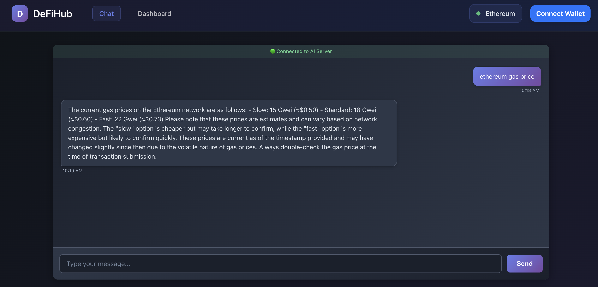

# DeFi Chat Agent

A conversational AI interface for DeFi operations, combining traditional dashboard functionality with an intelligent chat interface that understands natural language and dynamically renders UI components.



*Chat-based DeFi interactions with AI-powered assistance and generative UI*

## 🚀 Overview

This application provides a **hybrid approach to DeFi**, offering both a traditional dashboard and an innovative chat-first interface. Users can interact through natural language with an AI agent that not only provides information but also dynamically renders appropriate UI components for DeFi operations.

**Key Innovation**: The AI agent doesn't just return text responses—it generates **structured UI intents** that render relevant React components (like TokenSwap, NetworkStatus, LendingSection) directly in the chat interface based on the conversation context.

## ✨ Features

### 🤖 AI-Powered Chat Interface
- **Natural Language Processing**: Ask questions like "What are gas prices?" or "Show me lending rates"
- **Generative UI**: AI dynamically renders appropriate UI components based on conversation context
- **Real-time Communication**: WebSocket-based chat with automatic reconnection and fallback support
- **Context Awareness**: Maintains conversation history and understands follow-up questions
- **Educational Responses**: Provides explanations and context alongside data

### 🔧 Traditional DeFi Dashboard
- **Token Swapping**: 1inch integration for optimal swap routes and pricing
- **Perpetuals Trading**: GMX integration for leveraged trading positions
- **Lending & Borrowing**: Compound and Aave protocol integration
- **Portfolio Tracking**: Real-time balance monitoring and asset management
- **Gas Price Monitoring**: Multi-chain gas price tracking with visual indicators

### 🏗️ Technical Features
- **Dual Interface**: Seamlessly switch between chat and traditional dashboard
- **Multi-Chain Support**: Ethereum, Polygon, BSC, Arbitrum, Optimism
- **Wallet Integration**: MetaMask and multi-wallet support via RainbowKit
- **Error Resilience**: Robust error boundaries and graceful degradation
- **Responsive Design**: Optimized for desktop, tablet, and mobile devices

## 🚀 Getting Started

### Prerequisites
- **Node.js** v18.0.0 or higher (v22.18.0 recommended)
- **npm** package manager

### Quick Start

1. **Clone and install**:
```bash
git clone <your-repo-url>
cd defi-chat-agent
npm install
```

2. **Start the frontend**:
```bash
npm start
```

3. **Open the application**: [http://localhost:3000](http://localhost:3000)

### Full AI Functionality (Optional)

To enable real AI chat features, you'll need to run the GenAI server:

1. **Set up the server** (see [server/README.md](server/README.md) for details):
```bash
cd server
npm install
cp .env.example .env
# Edit .env and add your OpenAI or Anthropic API key
```

2. **Start the server**:
```bash
cd server
npm run dev
```

The frontend will automatically connect to the server when available, or use mock responses when the server isn't running.

## 📜 Available Scripts

```bash
npm start                                    # Start development server
npm run build                               # Build for production
npm test -- --watchAll=false               # Run all tests once
npm test -- --coverage --watchAll=false    # Run tests with coverage report
npm test -- --testPathPattern=Chat         # Run specific test files
npm run lint                                # Run ESLint on client code
npm run lint:fix                            # Fix ESLint errors automatically
npm run format                              # Check code formatting with Prettier
npm run format:fix                          # Fix code formatting automatically
npm run test:staged                         # Run tests for staged files only
npm run test:related                       # Run tests for changed files
```

## 🔒 Pre-commit Hooks

This project uses [Husky](https://typicode.github.io/husky/) and [lint-staged](https://github.com/okonet/lint-staged) to automatically validate code quality before commits.

### What Runs on Commit

When you run `git commit`, the following checks run automatically:

#### 1. Linting and Formatting
- **Client files** (`.js`, `.jsx`): ESLint fixes issues, then Prettier formats code
- **Server files** (`server/**/*.js`): ESLint and Prettier run using server-specific configurations
- **JSON/Markdown files**: Prettier formats automatically
- **Package files**: JSON syntax validation + formatting

#### 2. File Validation
- **Merge conflicts**: Blocks commits with unresolved conflict markers (`<<<<<<<`, `=======`, `>>>>>>>`)
- **Large files**: Warns about files > 1MB (suggests Git LFS for large assets)
- **Binary files**: Warns about common binary file types (images, executables, etc.)
- **Secrets detection**: Warns about potential API keys, passwords, tokens, and private keys in code

#### 3. Testing
- **Client tests**: Runs related tests when `src/` or `tst/` files are changed
- **Server tests**: Runs related tests when `server/src/` or `server/tests/` files are changed
- Uses Jest's `--findRelatedTests` to only run tests for changed files
- Skips tests if only config files (JSON, Markdown) are changed

### Performance

- Hooks are optimized to run in **< 30 seconds** for typical commits
- Only **staged files** are checked (not the entire codebase)
- Tests run only for **related files** (using Jest's `--findRelatedTests`)
- A warning is displayed if hooks take longer than 30 seconds

### Error Messages

The hooks provide clear, actionable error messages:
- Shows which step failed and how long it took
- Provides specific commands to fix issues
- Displays file names and line numbers when relevant
- Includes summary of what was checked

### Bypassing Hooks

In emergency situations, you can bypass hooks using:

```bash
git commit --no-verify
```

**⚠️ Warning**: Only use `--no-verify` when absolutely necessary (e.g., hotfixes, WIP commits). Bypassing hooks can lead to:
- Broken CI/CD pipelines
- Code quality issues
- Test failures in production
- Security vulnerabilities (if secrets are committed)

### Troubleshooting

**Hooks not running?**
```bash
# Reinstall Husky
npm run prepare
# Or manually
npx husky install
```

**Hooks too slow?**
- Check if you're staging too many files at once
- Consider committing in smaller chunks
- Run `npm run lint:fix` and `npm run format:fix` manually before committing
- Large test suites may take longer; consider running tests separately for big changes

**Need to fix formatting/linting?**
```bash
npm run lint:fix      # Fix linting issues
npm run format:fix    # Fix formatting issues
```

**Secrets detected?**
- Review the warnings carefully - they may be false positives (test data, placeholders)
- If real secrets are detected, remove them immediately and rotate any exposed credentials
- Use environment variables or secure secret management for actual secrets

## 🧪 Testing

Run the comprehensive test suite:

```bash
npm test -- --watchAll=false                           # All tests
npm test -- --coverage --watchAll=false                # With coverage report
npm test -- --testPathPattern=Chat --watchAll=false    # Chat-specific tests
```

## 🔧 Environment Variables

Create a `.env` file in the project root:

```bash
# Optional: GenAI server WebSocket URL (defaults to ws://localhost:3001)
REACT_APP_GENAI_SERVER_URL=ws://localhost:3001

# Optional: API keys for DeFi integrations
REACT_APP_1INCH_API_KEY=your_1inch_key
REACT_APP_ALCHEMY_API_KEY=your_alchemy_key
```

## �  Documentation

- **[Server Documentation](server/README.md)**: GenAI server setup and configuration
- **[Architecture Overview](design_document.md)**: Comprehensive system design
- **[Implementation Status](agentic_implementation_plan.md)**: Current progress and next steps
- **[Workflow Guide](agentic_workflow.md)**: Development workflow and examples
- **[Specifications](.kiro/specs/)**: Detailed feature specifications and requirements

## 📄 License

MIT License - see LICENSE file for details.
