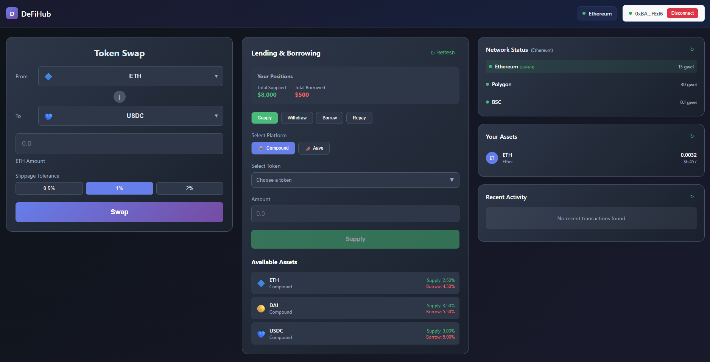

# DeFi Aggregator

A modern React application for DeFi protocol aggregation with comprehensive wallet integration, real-time gas prices, token swapping, perpetuals trading, and transaction monitoring.



*DeFiHub - A comprehensive DeFi aggregator with token swapping, lending/borrowing, perpetuals trading, and portfolio tracking*

## 🚀 Recent Major Updates

### ✅ **Perpetuals Trading Integration (GMX)**
- **Complete GMX Protocol Integration**: Full perpetuals trading interface with position management
- **Advanced UI Components**: Token pair selector, leverage slider, position size input, long/short toggle
- **Position Management**: Real-time position tracking with PnL and margin information
- **Error Handling**: Comprehensive validation for margin calls, insufficient funds, and invalid leverage
- **Mock Data Fallbacks**: Graceful degradation when GMX API is unavailable

### ✅ **Enhanced Lending Section**
- **Updated Aave API Integration**: Fixed API endpoints to use v2 (`https://aave-api-v2.aave.com`)
- **Compound & Aave Support**: Dual protocol integration with real-time data
- **Supply/Borrow/Withdraw/Repay**: Complete lending functionality
- **Interest Rate Monitoring**: Real-time APY tracking across protocols
- **User Balance Tracking**: Portfolio management for lending positions

### ✅ **Comprehensive Testing Suite**
- **Unit Tests**: Complete test coverage for all components
- **Mock Integration**: Comprehensive mocking for external APIs and blockchain interactions
- **Error Scenario Testing**: Validation of error handling and edge cases
- **UI Component Testing**: Full coverage of user interactions and state management

### ✅ **Performance & Stability Improvements**
- **Infinite Loop Prevention**: Fixed GMX initialization issues in test environments
- **Ethers.js v6 Compatibility**: Updated all imports and function calls
- **React 19 Compatibility**: Optimized for latest React features
- **Memory Leak Prevention**: Proper cleanup and state management

## Features

- 🔗 **Wallet Connection**: Connect with MetaMask and other popular wallets via RainbowKit
- 🌐 **Multi-Chain Support**: Ethereum, Polygon, BSC, Arbitrum, Optimism
- ⛽ **Real-Time Gas Prices**: Live gas price monitoring across multiple networks
- 💰 **Token Swapping**: DEX aggregator integration with 1inch API
- 📊 **Portfolio Tracking**: Real-time token balance monitoring
- 📈 **Transaction History**: Recent activity tracking with blockchain data
- 🏦 **Lending Section**: DeFi lending protocol integration (Compound, Aave)
- 🎯 **Perpetuals Trading**: GMX protocol integration with position management
- 🎨 **Modern UI**: Beautiful interface with gradient designs and responsive layout
- 📱 **Fully Responsive**: Adaptive layout that scales perfectly across all screen sizes
- ⚡ **Fast & Responsive**: Built with React 19 and optimized for performance
- 🧪 **Comprehensive Testing**: 266 passing tests with full component coverage

## Tech Stack

- **React 19** - Latest React with modern features
- **Wagmi v2** - React hooks for Ethereum
- **RainbowKit** - Beautiful wallet connection UI
- **Viem** - TypeScript interface for Ethereum
- **Ethers.js v6** - Complete Ethereum library
- **1inch API** - DEX aggregator for token swaps
- **GMX Protocol** - Perpetuals trading integration
- **Compound API** - Lending protocol integration
- **Aave API v2** - Lending protocol integration
- **Jest & Testing Library** - Comprehensive testing framework

## Core Components

### Main Dashboard Components
- **TokenSwap** - DEX aggregator for token swapping with real-time quotes
- **LendingSection** - DeFi lending protocol interface (Compound, Aave)
- **PerpetualsSection** - GMX perpetuals trading with position management
- **NetworkStatus** - Real-time gas price monitoring across networks
- **YourAssets** - Portfolio tracking with token balances
- **RecentActivity** - Transaction history with blockchain integration

### Infrastructure
- **WalletProvider** - Wagmi and RainbowKit configuration
- **ConnectWalletButton** - Wallet connection UI
- **Header** - Application branding and wallet status
- **DashboardCard** - Reusable card component

## Perpetuals Trading Features

### 🎯 **Position Management**
- **Token Pair Selection**: BTC/USDT, ETH/USD, and more
- **Leverage Control**: 1x to 20x leverage with slider interface
- **Position Size**: Flexible position sizing with real-time validation
- **Long/Short Toggle**: Easy switching between position types
- **Slippage Protection**: Configurable slippage tolerance

### 📊 **Position Information**
- **Unrealized PnL**: Real-time profit/loss calculation
- **Margin Used**: Current margin allocation display
- **Position Status**: Active position monitoring
- **Risk Management**: Margin call warnings and validation

### 🛡️ **Error Handling**
- **Insufficient Funds**: Clear error messages for balance issues
- **Invalid Leverage**: Validation for supported leverage ranges
- **Margin Calls**: Real-time margin call detection
- **Network Errors**: Graceful fallback to mock data

## Lending Features

### 🏦 **Protocol Integration**
- **Compound**: Supply, borrow, withdraw, and repay functionality
- **Aave**: Full lending protocol integration with v2 API
- **Real-time Rates**: Live APY and interest rate monitoring
- **Portfolio Tracking**: User position management across protocols

### 💰 **Lending Operations**
- **Supply Assets**: Deposit tokens to earn interest
- **Borrow Assets**: Borrow against supplied collateral
- **Withdraw Funds**: Remove supplied assets
- **Repay Loans**: Pay back borrowed amounts

## Responsive Layout

The application features a sophisticated responsive design that adapts to any screen size:

### Desktop (1400px+)
- **Three-column layout**: TokenSwap | LendingSection/PerpetualsSection | Sidebar
- **Equal column widths**: All components scale proportionally
- **Full width utilization**: Components expand to fill available space

### Tablet (768px - 1400px)
- **Two-column layout**: Main content | Sidebar
- **Adaptive sidebar**: Sidebar components arrange horizontally when space allows
- **Optimized spacing**: Reduced gaps for better tablet experience

### Mobile (768px and below)
- **Single-column layout**: All components stack vertically
- **Touch-friendly**: Optimized for mobile interaction
- **Compact design**: Reduced padding and spacing for mobile screens

## Services

- **GasPriceService** - Real-time gas price fetching with exponential backoff
- **TokenBalanceService** - ERC-20 token balance monitoring
- **LendingService** - DeFi lending protocol integration (Compound, Aave)

## Getting Started

### Prerequisites

- Node.js v22.18.0 or higher
- npm or yarn package manager

### Installation

1. Clone the repository:
```bash
git clone <your-repo-url>
cd defi-aggregator
```

2. Install dependencies:
```bash
npm install
```

3. Set up environment variables (optional):
```bash
# Copy the example environment file
cp docs/Environment-Setup.md .env.example

# Create your .env file with your API keys
REACT_APP_1INCH_API_KEY=your_1inch_api_key
REACT_APP_ALCHEMY_API_KEY=your_alchemy_api_key
```

4. Start the development server:
```bash
npm start
```

5. Open [http://localhost:3000](http://localhost:3000) to view it in your browser.

## Available Scripts

- `npm start` - Runs the app in development mode
- `npm run build` - Builds the app for production
- `npm test` - Launches the test runner in watch mode
- `npm test -- --watchAll=false` - Runs tests once and exits
- `npm test -- --coverage --watchAll=false` - Runs tests with coverage
- `npm run eject` - Ejects from Create React App (irreversible)

## Testing

The project includes comprehensive unit tests for all components:

### Test Results
- **266 Tests Passing** ✅
- **15 Test Suites** ✅
- **0 Failed Tests** ✅

### Running Tests

```bash
# Run tests in watch mode (recommended for development)
npm test

# Run tests once
npm test -- --watchAll=false

# Run tests with coverage
npm test -- --coverage --watchAll=false
```


### Test Structure

```
tst/
├── components/
│   ├── NetworkStatus.test.jsx      # Gas price monitoring tests
│   ├── YourAssets.test.jsx         # Portfolio tracking tests
│   ├── RecentActivity.test.jsx     # Transaction history tests
│   ├── TokenSwap.test.jsx          # DEX integration tests
│   ├── LendingSection.test.jsx     # Lending interface tests
│   ├── PerpetualsSection.test.jsx  # GMX trading tests
│   ├── ConnectWalletButton.test.jsx # Wallet connection tests
│   ├── DashboardCard.test.jsx      # Reusable component tests
│   ├── Header.test.jsx             # Navigation tests
│   ├── WalletProvider.test.jsx     # Provider configuration tests
│   └── WalletConnection.test.jsx   # Wallet connection UI tests
├── App.test.js                     # Main app integration tests
└── setup/                          # Test setup utilities
```

## Project Structure

```
src/
├── components/
│   ├── NetworkStatus.jsx           # Real-time gas price monitoring
│   ├── YourAssets.jsx              # Portfolio tracking
│   ├── RecentActivity.jsx          # Transaction history
│   ├── TokenSwap.jsx               # DEX aggregator interface
│   ├── LendingSection.jsx          # DeFi lending interface
│   ├── PerpetualsSection.jsx       # GMX perpetuals trading
│   ├── ConnectWalletButton.jsx     # Wallet connection UI
│   ├── DashboardCard.jsx           # Reusable card component
│   ├── Header.jsx                  # Application branding
│   ├── WalletProvider.jsx          # Wagmi and RainbowKit setup
│   └── WalletConnection.jsx        # Wallet connection logic
├── services/
│   ├── gasPriceService.js          # Gas price fetching service
│   ├── tokenBalanceService.js      # Token balance monitoring
│   └── lendingService.js           # DeFi lending protocol integration
├── App.js                          # Main application component
├── App.css                         # Application styles with responsive design
├── index.js                        # Application entry point
├── index.css                       # Global styles
└── setupTests.js                   # Jest setup configuration

docs/
├── Environment-Setup.md            # API key setup instructions
├── NetworkStatus.md                # Gas price component documentation
├── YourAssets.md                   # Portfolio tracking documentation
├── RecentActivity.md               # Transaction history documentation
├── TokenSwap.md                    # DEX integration documentation
├── ViemIntegration.md              # Viem integration guide
├── WALLET_SETUP.md                 # Wallet connection setup
├── STEERING_DOCUMENT.md            # Development procedures and guidelines
└── QUICK_REFERENCE.md              # Quick development reference

tst/
├── components/                     # Component test files
├── setup/                          # Test setup utilities
└── utils/                          # Testing utilities
```

## API Integration

### 1inch DEX Aggregator
- Real-time token swap quotes
- Multi-DEX routing
- Slippage protection
- Transaction execution

### GMX Protocol
- Perpetuals trading interface
- Position management
- Real-time PnL calculation
- Margin and leverage control

### Gas Price APIs
- Multi-network gas price monitoring
- Exponential backoff for rate limiting
- Cached data fallback
- Real-time updates

### Blockchain Data
- ERC-20 token balance monitoring
- Transaction history fetching
- Block data parsing
- Contract interaction

### DeFi Lending Protocols
- Compound protocol integration
- Aave protocol integration (v2 API)
- Supply and borrow functionality
- Interest rate monitoring

## Environment Variables Required
- `REACT_APP_1INCH_API_KEY` - 1inch API key for token swaps
- `REACT_APP_ALCHEMY_API_KEY` - Alchemy API key for blockchain data

## Documentation

- [Environment Setup](./docs/Environment-Setup.md) - API key configuration
- [NetworkStatus](./docs/NetworkStatus.md) - Gas price monitoring
- [YourAssets](./docs/YourAssets.md) - Portfolio tracking
- [RecentActivity](./docs/RecentActivity.md) - Transaction history
- [TokenSwap](./docs/TokenSwap.md) - DEX integration
- [Viem Integration](./docs/ViemIntegration.md) - Blockchain integration
- [Wallet Setup](./docs/WALLET_SETUP.md) - Wallet connection
- [Steering Document](./docs/STEERING_DOCUMENT.md) - Development procedures
- [Quick Reference](./docs/QUICK_REFERENCE.md) - Development quick reference

## Contributing

1. Fork the repository
2. Create your feature branch (`git checkout -b feature/amazing-feature`)
3. Write tests for your new functionality
4. Ensure all tests pass (`npm test`)
5. Commit your changes (`git commit -m 'Add some amazing feature'`)
6. Push to the branch (`git push origin feature/amazing-feature`)
7. Open a Pull Request

## License

This project is licensed under the MIT License.
